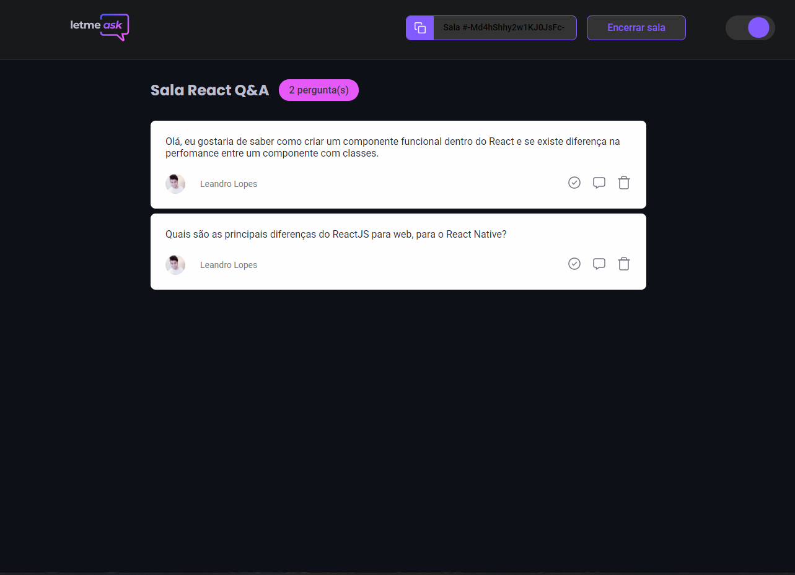

  

## Let Me Ask

<h4 align="center">
  Let Me Ask é uma projeto que foi criado durante o NLW Together da <a href="https://rocketseat.com.br/" target="_blank">Rocketseat</a> com o objetivo de ajudar streamers, onde é possivel reunir as perguntas de seus espectadores durante a trasmissão e feito uma votção para escolher as perguntas que serão respondidas.
</h4>

  <a href="https://letmeask-nlw-781b6.firebaseapp.com/">Demostração</a>

 

## Tecnologias
No projeto são utilizado tecnologias como:
- [ReactJS](https://reactjs.org/)
- [Typescript](https://www.typescriptlang.org/)
- [Firebase Authentication](https://firebase.google.com/products/auth)
- [Firebase Realtime Database](https://firebase.google.com/products/realtime-database)

## Layout
Você pode visualizar o layout do projeto <a href="https://www.figma.com/file/Xe6YZgyYQGSvdtWZWtlhgw/Letmeask---NLW-6?node-id=0%3A1" target="_blank">clicando aqui</a>.
